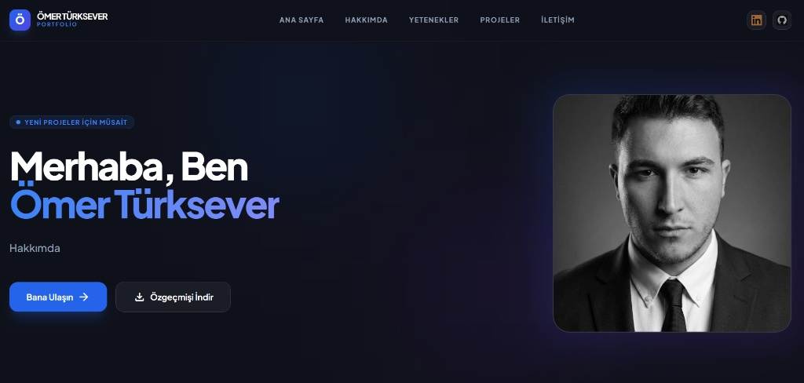
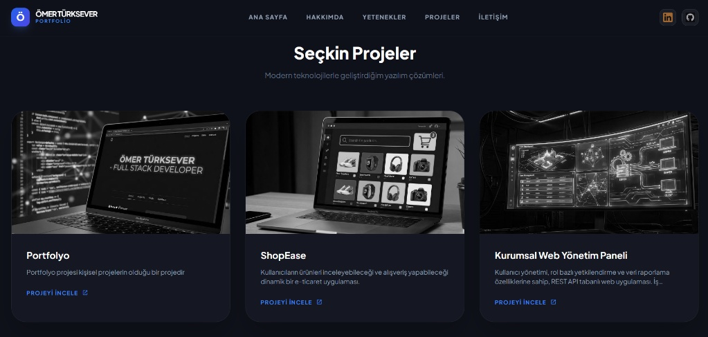
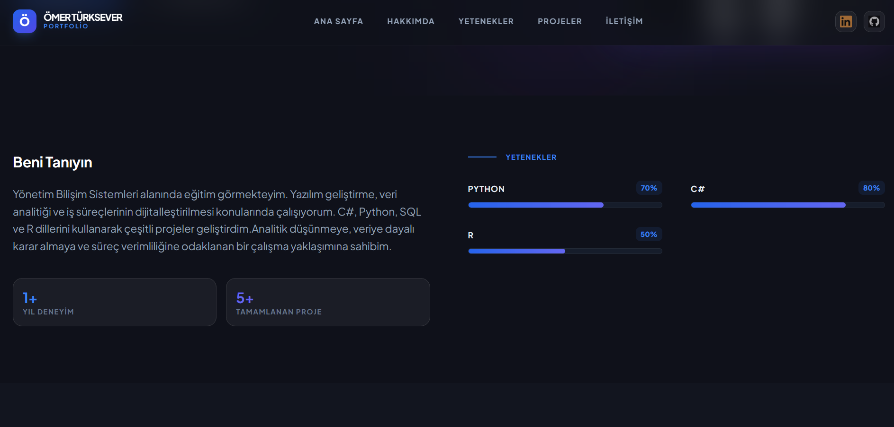
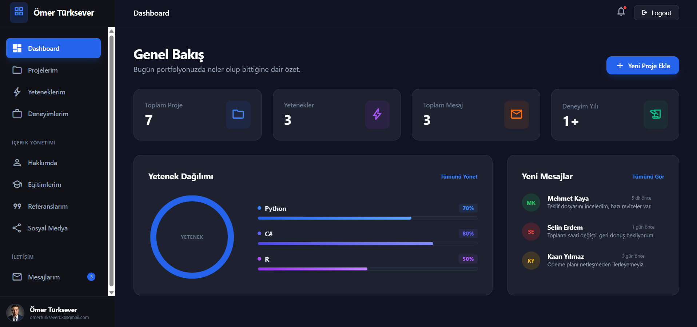
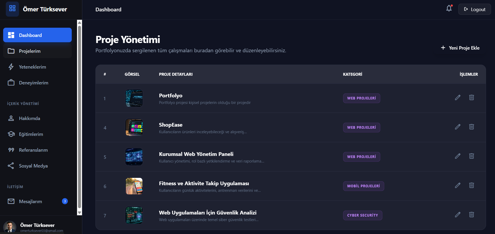
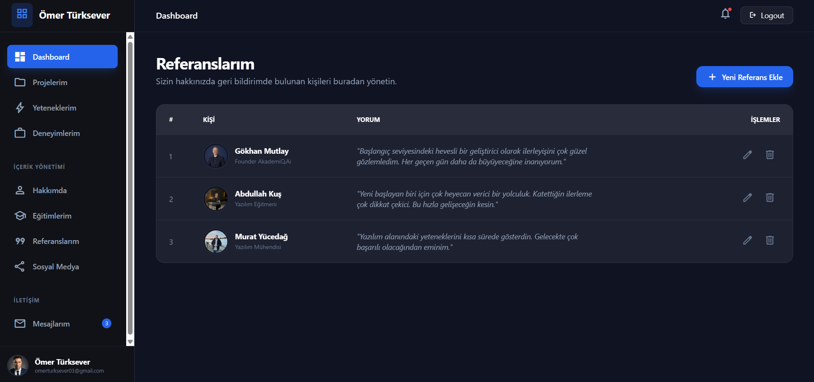

# 🚀 ASP.NET Core Portfolyo Projesi (AkademiQPortfolio) 
Bu proje, ASP.NET Core MVC mimarisi kullanılarak geliştirilmiş, hem son kullanıcıya hitap eden şık bir portfolyo sitesi hem de tüm içeriğin yönetilebildiği kapsamlı bir Admin Paneli içeren full-stack bir web uygulamasıdır. 

Projenin temel amacı; backend mantığını, veritabanı yönetimini ve modern arayüz bileşenlerini dinamik bir yapıda birleştirerek, yönetilebilir bir sistem ortaya koymaktır. Sitedeki tüm veriler (projeler, deneyimler, yetenekler vb.) statik kodlama yerine tamamen veritabanından çekilmektedir. 

## 🧱 Projenin Genel Yapısı 
Dinamik Yönetim: Hakkımda, eğitim, deneyim, yetenekler ve projeler gibi tüm bölümler admin paneli üzerinden kontrol edilir.

 -**Admin Paneli:** İçerik ekleme, silme ve güncelleme (CRUD) işlemlerinin yapılabildiği yetkilendirilmiş bir yönetim alanı.

-**Modern Arayüz:** Kullanıcı tarafında şık, karanlık mod odaklı ve duyarlı (responsive) bir tasarım.

- **Veri İlişkilendirme:** Kategoriler ve projeler arasında kurulan ilişkisel veritabanı yapısı. 

## 🛠️ Kullanılan Teknolojiler 
-**Backend:** ASP.NET Core 8.0 MVC.

- **Veritabanı & ORM:** MS SQL Server & Entity Framework Core (Database-First). 

- **Frontend:** Tailwind CSS, Razor Pages, JavaScript.

- **Araçlar:** Visual Studio 2022, Git & GitHub. 

## 📸 Uygulama Ekran Görüntüleri
Uygulamanın kullanıcı tarafı ve yönetim paneli ekranlarından bazı kesitler aşağıda sunulmuştur. 

## 🌐 Kullanıcı Arayüzü (Frontend)
**🏠 Ana Sayfa & Hakkımda:** Ziyaretçileri karşılayan, kişisel bilgilerin ve genel bakışın yer aldığı dinamik bölüm. 

## 

**📂 Projeler Bölümü:** Geliştirilen projelerin (ShopEase, Portfolyo, Güvenlik Analizi vb.) görselleri ve açıklamalarıyla listelendiği alan. 

## 

**💼 Deneyimler & Yetenekler:** Eğitim hayatı ve profesyonel iş tecrübelerinin kronolojik olarak sergilendiği bölüm. 

## 

### 🔐 Admin Paneli (Backend) 
**📊 Dashboard:** Sistemdeki toplam proje sayısı, gelen mesajlar ve genel istatistiklerin yer aldığı özet ekranı.

## 

**⚙️ İçerik Yönetimi:** Tüm sayfaların (About, Experience, Skill, Project vb.) verilerinin yönetildiği CRUD ekranları. 

## 

**💬 Referanslar Yönetimi:** Sizin hakkınızda geri bildirimde bulunan kişilerin ve yorumlarının yönetildiği bölümdür

## 

## 🎯 Projeden Kazanımlar Bu geliştirme süreci sonunda elde edilen temel yetkinlikler:

MVC Mimarisi: Model, View ve Controller arasındaki veri akışını yönetme.
Veritabanı Yönetimi: Entity Framework Core ile SQL tablolarını nesneye dönüştürme ve sorgulama.
Dinamik İçerik: Razor syntax kullanarak veritabanındaki verileri arayüze entegre etme. 
Yönetim Paneli Mantığı: Son kullanıcıdan bağımsız bir kontrol mekanizması kurgulama.

